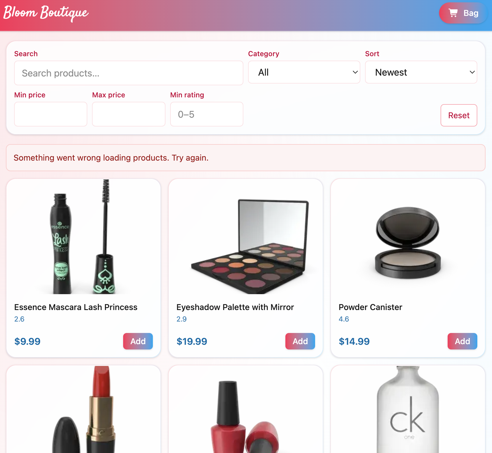

# Bloom Boutiqe

- A small storefront with **search**, **filters**, **sorting**, **pagination**, and a **cart** persisted in `localStorage`. Built to meet course requirements.

---

## CONTENTS

* [User Experience](#user-experience-ux)
  * [User Stories](#user-stories)
  * [Client Goals](#client-goals)
  * [First Time Visitor Goals](#first-time-visitor-goals)
  * [Returning Visitor Goals](#returning-visitor-goals)

* [Design](#design)
  * [Colour Scheme](#colour-scheme)
  * [Typography](#typography)
  * [Imagery](#imagery)
  * [Wireframes](#wireframes)

* [Features](#features)
  * [Future Implementations](#future-implementations)
  * [Accessibility](#accessibility)

* [Technologies Used](#technologies-used)
  * [Languages Used](#languages-used)
  * [Frameworks, Libraries & Programs Used](#frameworks-libraries--programs-used)

* [Deployment](#deployment)
  * [Deployment](#deployment)

* [Testing](#testing)

* [Credits](#credits)
  * [Code Used](#code-used)
  * [Content](#content)
  * [Media](#media)

---

## User Experience (UX)

### User Stories

- As a user I can **search** products so that I quickly find what I need.

- As a user I can **filter by category, price range and minimum rating** so results are relevant.

- As a user I can **sort** (Newest, Price Low→High, Price High→Low, Rating) to compare easily.

- As a user I can **paginate** through results and keep my place.

- As a user I can **add/remove and change quantity** in a **cart drawer**.

- As a user my cart should **persist after reload** (localStorage).

- As a user I can use the app with **keyboard** and screen-reader friendly labels.

### Client Goals

- Modern, responsive, accessible catalog UI.
- Clean codebase: TypeScript strict, ESLint + Prettier clean.
- State handled with best practices (React Query for server state, Zustand for cart).

### First Time Visitor Goals

- Understand at a glance what the store offers.
- Find products quickly via search and filters.
- Add to cart without page reloads.

### Returning Visitor Goals

- Pick up where they left off (cart persists).
- Share/bookmark URLs that **encode the current filters & page**.

## Design

### Colour Scheme

- Soft **rose → sky** gradient accents on header/buttons; clean white cards; subtle borders & shadows.

### Typography

- The brand title uses **Satisfy** (via `next/font/google`), all body text stays with the default system stack for readability.

[Google Fonts]('https://fonts.googleapis.com/css2?family=Satisfy&family=Sirivennela&display=swap')

### Imagery

- Product images are from DummyJSON and are optimized with `next/image`.

### Wireframes

- Simple responsive grid (2 cols on mobile, 3 on tablet, 4 on desktop), filter bar on top, cart as drawer.  
_(No separate wireframe files; layout is straightforward.)_

## Features

 * Catalog page: The site is only one page site, with debounced search, category/price/rating filters, sorting, and pagination.

### Future Implementations

- Price formatting and currency switcher.
- Wishlist or “Save for later”.
- Server-side pagination with caching per filter.
- Basic unit tests for URL helpers and cart store.
- Hompage, checkoutpage and maybe more pages.

### Accessibility

The site is accesibly to all screens.

## Technologies Used

### Languages Used

### Frameworks, Libraries & Programs Used

1. [Next.js (App Router):](https://nextjs.org/)
    - React-based framework for routing, API routes, image/font optimization, and production builds.
1. [React 18:](https://react.dev/)
    - UI library powering all components and hooks.
1. [Google Fonts:](https://fonts.google.com/)
    - Google fonts to set the fonts of the site.
1. [Font Awesome:](https://fontawesome.com/)
    - Font Awesome is a site to get icons from and theres where i got my icons from.
1. [TypeScript (Strict):](https://www.typescriptlang.org/)
    - Static typing with strict mode enabled for safer, clearer code.
1. [Git:](https://git-scm.com/)
    - Git was used for version control.
1. [GitHub:](https://github.com/)
    - GitHub is where my repositry is found.
1.  [TanStack Query (React Query) v5:](https://tanstack.com/query/latest)
    - Server-state fetching/caching for products and categories. 
1. [Zustand:](https://github.com/pmndrs/zustand)
    - State management for the cart (add/remove/± qty) with optimistic updates.
1. [Zustand Persist (localStorage):](https://github.com/pmndrs/zustand#persist-middleware)
    - Persists the cart across reloads using `localStorage`.
1. [Tailwind CSS:](https://tailwindcss.com/)
    - Utility-first CSS for responsive layout and components.
1. [DummyJSON Products API:](https://dummyjson.com/)
    - Public API providing products & categories (proxied via Next API routes).
1. [ESLint:](https://eslint.org/)
    - Linting to enforce best practices (no lint errors).
1. [Prettier:](https://prettier.io/)
    - Code formatter for consistent style.
1. [Gitpod:](https://www.gitpod.io/)
    - Cloud development environment used to build and run the project.

## Deployment 

### Prerequisites

- Node.js 18+
- npm

### Install

- npm i

### Run locally

 - npm run dev

## Testing

- I manually tested the site after building it.

## Credits

### Code used 

- DummyJSON API

### Content

- Product titles/prices/ratings from DummyJSON.

### Media

- Product images from DummyJSON; brand font “Satisfy” from Google Fonts.

